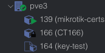

# Proxmox-Container-Locked
documentation on how to resolve a locked lxc/container in proxmox

Example of a locked container

To fix it:

1. Check the container status
In the Proxmox shell (or via SSH):

## (x) would be the container number
    pct status x
2. Check for active locks
#
     pct unlock x
Container would be unlocked right away and the lock symbol would be gone from promox side/site.

Step 1: Check if a task is still running

SSH into your Proxmox node or open the Proxmox shell, then run:
#
    ps aux | grep vzdump
Output in my case 
##
    root 3068198 0.0 0.0 6336 2176 pts/0 S+ 00:04 0:00 grep vzdump
A runnning vzdump would look like this 
##
    root     12345  0.3  1.2 123456 45678 ?  S  23:41   0:15 vzdump --compress zstd --dumpdir /var/lib/vz/dump --storage local-lvm 100

Column by column breakdown

| Column   | Example Value | Meaning                                                                 |
|----------|---------------|-------------------------------------------------------------------------|
| USER     | root          | The user that owns the process. In Proxmox, most system jobs run as root. |
| PID      | 12345         | Process ID. Each running process has a unique number. Useful with `kill -9 PID`. |
| %CPU     | 0.3           | Current CPU usage (as % of one core). `100` = fully using one CPU core. |
| %MEM     | 1.2           | Percentage of system RAM used by the process.                           |
| VSZ      | 123456        | Virtual Memory Size (KB). Memory reserved, not necessarily used.        |
| RSS      | 45678         | Resident Set Size (KB). Actual physical RAM used by the process.        |
| TTY      | ? / pts/0     | Terminal attached. `?` = none (background job). `pts/0` = your shell.  |
| STAT     | S             | Process state. `S` = Sleeping, `R` = Running, `Z` = Zombie, `D` = I/O wait. |
| START    | 23:41         | The time the process started.                                           |
| TIME     | 0:15          | Total CPU time consumed (minutes:seconds).                             |
| COMMAND  | vzdump ...    | Command and arguments that started the process.                        |
